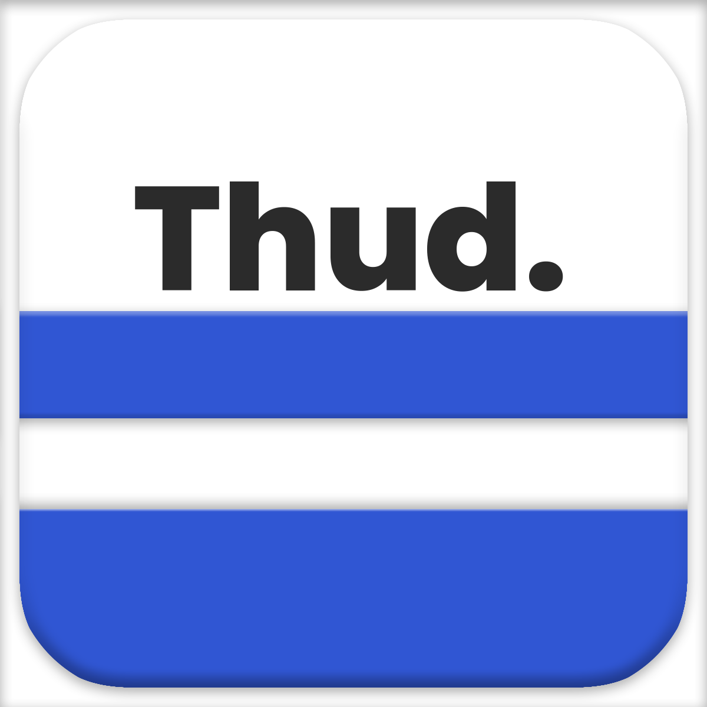

<div id="top"></div>
<!--
*** Thanks for checking out the Best-README-Template. If you have a suggestion
*** that would make this better, please fork the repo and create a pull request
*** or simply open an issue with the tag "enhancement".
*** Don't forget to give the project a star!
*** Thanks again! Now go create something AMAZING! :D
-->


<!-- PROJECT SHIELDS -->
<!--
*** I'm using markdown "reference style" links for readability.
*** Reference links are enclosed in brackets [ ] instead of parentheses ( ).
*** See the bottom of this document for the declaration of the reference variables
*** for contributors-url, forks-url, etc. This is an optional, concise syntax you may use.
*** https://www.markdownguide.org/basic-syntax/#reference-style-links

[![Stargazers][stars-shield]][stars-url]
[![MIT License][license-shield]][license-url]
[![LinkedIn][linkedin-shield]][linkedin-url]-->


<!-- PROJECT LOGO -->
<br />
<div align="center">
  <a href="https://github.com/aerotoad/Thud">
    
  </a>

<h3 align="center">Thud.</h3>

  <p align="center">
    Read news without the fuss
    <br />
    <!--<a href="https://github.com/github_username/repo_name"><strong>Explore the docs »</strong></a>
    <br />
    <br />
    <a href="https://github.com/github_username/repo_name">View Demo</a>-->
    ·
    <a href="https://github.com/aerotoad/Thud/issues">Report Bug</a>
    ·
    <a href="https://github.com/aerotoad/Thud/issues">Request Feature</a>
  </p>
</div>

<div align="center">
  
<a href="">[![Stargazers][stars-shield]][stars-url]</a>
<a href="">[![MIT License][license-shield]][license-url]</a>
<a href="">[![LinkedIn][linkedin-shield]][linkedin-url]</a>

</div>


<!-- TABLE OF CONTENTS -->
<details>
  <summary>Table of Contents</summary>
  <ol>
    <li>
      <a href="#about-the-project">About The Project</a>
      <ul>
        <li><a href="#built-with">Built With</a></li>
      </ul>
    </li>
    <li>
      <a href="#getting-started">Getting Started</a>
      <ul>
        <li><a href="#prerequisites">Prerequisites</a></li>
      </ul>
    </li>
    <li><a href="#contributing">Contributing</a></li>
    <li><a href="#license">License</a></li>
    <li><a href="#contact">Contact</a></li>
  </ol>
</details>


<!-- ABOUT THE PROJECT -->
## About The Project

<div align="center">

[![Product Name Screen Shot][product-screenshot]](https://example.com)
  
</div>

Thud. is a **free** and **open source** news reader for Android and iOS inspired by the original design of Pulse News.

### Why did I build this?
Those of you who have been using news reader apps since the dawn of smartphones might remember one the first rockstars in the market: Pulse News (you can see it in all it's former glory [here](https://www.cnet.com/tech/mobile/pulse-news-reader-app-now-free-for-ios-android/))
It offered an incredible user experience for the time and a convenient way to view all your feeds quickly and efficiently, minimizing the interactions needed to get you to the content you chose to see.

Then LinkedIn [bought it](https://www.theverge.com/2013/4/11/4214206/linkedin-buys-news-reader-pulse-for-a-reported-90-million) and shortly after [ruined it](https://www.theverge.com/2015/6/17/8793547/linkedin-pulse-news-reader-app-update).

Ever since that terrible day I've wandered the barren landscape of the app stores waiting for a worthy contender. I've tried it all: the feedly official app, different feedly clients like Inoreader, Flipboard, Google News and Apple News. I even tried some Microsoft news apps :weary:.

And yet, to this day, I haven't been able to find a replacement that offers a similar user experience... so I decided to take the matter into my own hands and code it myself.

Here is the result, free and open source just in case LinkedIn decides to try to buy and destroy this one too.

### Features

- **Sleek mosaic-like UI**: All your feeds one blink away, no distractions.
- **Feed Search**: It uses the feedly search api to make it easier to discover news sources and add your favourite ones.
- **Bookmarks**: Save articles to read later or for whatever other reason, there for when you need them.
- **Light and Dark themes**: Complete with fancy (and silly) apple-like names like Darcula and Snowflake (because light and dark are just boring).
- **Collections**: Organise your feed into collections to keep them nice and tidy.
- **No account**: Yes, no account, no registration, no servers (besides the public feedly api). Your data is in your phone and remains there, as it should.
- **Multiple reading settings**: Change the background, typefont and font size.

<p align="right">(<a href="#top">back to top</a>)</p>


### Built With

* [Angular](https://angular.io/)
* [Ionic Framework](https://ionicframework.com/)
* [TailwindCSS](https://tailwindcss.com/)
* [Feedly API](https://developer.feedly.com/)

<p align="right">(<a href="#top">back to top</a>)</p>


<!-- GETTING STARTED -->
## Getting Started
> #### Woah! Wait right there cowboy!
> This section is for developers, if you are on GitHub, chances are you are one, but just in case, if you don't know what the difference is between a class and a function, head over to the friends at [Free Code Camp](https://www.freecodecamp.org/) and they'll get you started in no time.
> If you do know why [HTML cannot be parsed with a regular expression](https://stackoverflow.com/a/1732454) please, continue.

### Prerequisites

You need to install Node.js, then install the latest Ionic command-line tools in your terminal.
  ```sh
  npm install -g @ionic/cli
  ```
  
 Then you can follow the [Ionic Framework](https://ionicframework.com/) guides to install the native tools for [Android](https://ionicframework.com/docs/developing/android) and [iOS](https://ionicframework.com/docs/developing/ios).
 
 ### Running
 
 If you already have all the tools required, you can install it on your device by running:
 
 #### Android:
 Add Android platform if it doesn't exist:
   ```sh
  npx cap add android
  ```
  Build project and sync with capacitor platforms:
  ```
  ionic cap sync
  ```
  Open native Android project in Android Studio:
  ```
  npx cap open android
  ```
 And then use Android Studio to compile and run.
 
 #### iOS:
 Add iOS platform if it doesn't exist:
 ```sh
  npx cap add ios
  ```
  Build project and sync with capacitor platforms:
  ```
  ionic cap sync
  ```
  Open native iOS project in Xcode:
  ```
  npx cap open ios
  ```
  And then use Xcode to compile and run.

<!-- CONTRIBUTING -->
## Contributing

Contributions are what make the open source community such an amazing place to learn, inspire, and create. Any contributions you make are **greatly appreciated**.

If you have a suggestion that would make this better, please fork the repo and create a pull request. You can also simply open an issue with the tag "enhancement".
Don't forget to give the project a star! Thanks again!

1. Fork the Project
2. Create your Feature Branch (`git checkout -b feature/AmazingFeature`)
3. Commit your Changes (`git commit -m 'Add some AmazingFeature'`)
4. Push to the Branch (`git push origin feature/AmazingFeature`)
5. Open a Pull Request

<p align="right">(<a href="#top">back to top</a>)</p>


<!-- LICENSE -->
## License

Distributed under the AGPL License. See `LICENSE.txt` for more information.

<p align="right">(<a href="#top">back to top</a>)</p>


<!-- CONTACT -->
## Contact

Samuel Bazaga - [@aerotoad](https://twitter.com/aerotoad)

Project Link: [https://github.com/aerotoad/Thud](https://github.com/aerotoad/Thud)

<p align="right">(<a href="#top">back to top</a>)</p>


<!-- ACKNOWLEDGMENTS 
## Acknowledgments

* []()
* []()
* []()

<p align="right">(<a href="#top">back to top</a>)</p>-->


<!-- MARKDOWN LINKS & IMAGES -->
<!-- https://www.markdownguide.org/basic-syntax/#reference-style-links -->
[stars-shield]: https://img.shields.io/github/stars/aerotoad/Thud.svg?style=flat
[stars-url]: https://github.com/aerotoad/Thud/stargazers
[license-url]: https://github.com/aerotoad/Thud/blob/master/LICENSE
[license-shield]: https://img.shields.io/github/license/aerotoad/Thud
[linkedin-shield]: https://img.shields.io/badge/-LinkedIn-black.svg?style=flat&logo=linkedin&colorB=555
[linkedin-url]: https://www.linkedin.com/in/bazaga/
[product-screenshot]: readme-images/screenshot.png
